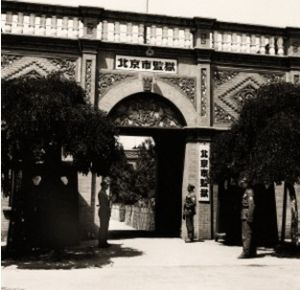
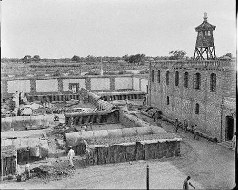
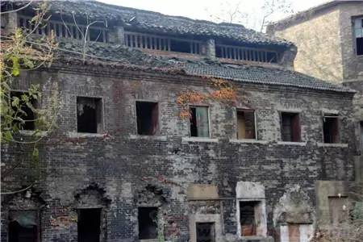
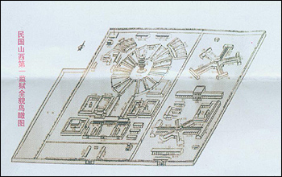

# 清末狱政改革回望

八国联军侵华后，清廷与列强签订《辛丑条约》， 为国内外形势所迫，不得不着手政治、教育、司法等全方位的改革，史称“清末新政”。狱政作为司法改革之一环， 也引起了全国上下前所未有的关注。

国际监狱改良运动与领事裁判权对中国近代监狱改良的影响。
 
清末以前的监狱多由其他建筑改造而成，如寺庙、练兵场等。其建筑不被重视，认为犯人在里面就是受苦，甚至不把他们当人来看待。鸦片战争后，西方国家的自由、平等、博爱等法律文化传入中国，主张废除死刑、改革肉刑、实行感化教育的刑罚思想在各国监狱制度中逐步体现。在这种思想的指导下，18世纪中叶，以剥夺人身自由为特点的自由刑主张盛行。作为自由刑的执行机关——监狱的改良也随之提到了议事日程，监狱管理制度发生了很大的变化，一些法学家和监狱改革家，认为应把教育、改造犯人作为行刑的主要目的和监狱管理的基础。欧美各国与日本都锐意革新狱政，改良型的监狱陆续出现，有关监狱改良的国际会议也相继召开。英国人约翰・霍华(1726—1790)监狱改良理论和杰雷姆・沁心(1748—1832)的辐射式监狱的规划对各国监狱改良有重要影响，随即各国进行了监狱改良。1609年后的荷兰监狱与1772年建立的比利时闵梭契夫阿司监狱同是“狱制改良之先驱者”。至19世纪，几乎所有的西方国家都进行了监狱改良。

1843年，《中英五口通商章程》首开了在华领事享有领事裁判权的恶例，使中国独立的司法主权受到严重侵害。对西方各国来说，拥有领事裁判权似乎基于极其“正当”的理由:“中国法律，不仅是极为专断和极为腐败地实施的，并且，它的体系在许多方面与欧洲人公平或正义的观念不相容”、“他们认为这些法律在一些重要的方面是残酷的不合理的，不愿受中国法律管辖，对其执法的公平正直是毫不信任的”。在西人对中国法律的指责方面，最受批评的“亦每在刑法、审判、监狱之不良”，基于以上原因，主张监狱改良的清廷大臣徐谦等人甚至已认识到“东西各国以囹圄之良窳觇政治之隆污。日本能撤去领事裁判权，首以改良监狱为根本……一切规模宜考酌东西洋办法，以示文明于诸国，为后日撤去领事裁判权及抵制租界监狱地步。”显然，治外司法主权的失落赋予了监狱改良动机的形成以直接推力。

国际社会对清朝监狱制度的抨击，使清廷认识到监狱改良的迫切性清朝监狱制度与西方资本主义国家的监狱制度比较起来显得十分落后。

刑罚苛刻，监狱不良，成为西方列强攫享在华领事裁判权的借口，他们指责“中国刑罚不脱体刑方式，过于严酷不合人道。因为监狱腐败，清朝政府往往被拒绝参加国际监狱改良的会议。从1846年第一次国际监狱改良会议在德国召开后，清朝政府仅获准参加了1910年在美国召开的第八次国际监狱会议，京师高等检察厅检查长徐谦、法部参议上行走兼奉天高等审判厅厅丞许世英奉命参加会议。徐谦在给清廷的报告中深有感触地说，自第一次国际监狱会议后，“各国莫不从事改良监狱，并设立万国监狱协会，分年于各国府召开，派遣委员会各将其国改良监狱事件，提出相互讨论，几视为国际竞争之事业。”在1910年召开的“海牙和平会”上，清朝又因法律不良而降为三等国，这些都使清朝统治集团中的一些人深切认识到，如果不改良监狱制度，将“难以自立图存。”统治利益之所在，监狱改革迫在眉睫，而苦辱的宗旨、重刑的理念无形中已成为设狱目的与实际情形相悖的根本原因，固有治狱思维之变革显然己是必要的，剩下的只是如何变革的问题。

较早提出监狱改良的是黄遵宪，1877年，他出使日本，回国后写了《日本杂事诗》，记载了日本明治维新后的监狱状况，“牢狱极为清洁，饮食起居，均有常度，病者或给以酒浆。但加拘禁，不复械系。一切诸苦，并不身受。虽定罪处绞者，行刑时，或引教士及神官、僧人为之讽经，俾令忏悔，仍祝以来生等到天堂云”，他提出了监狱改良方案:除了对罪犯实施监禁外，还要为流放的犯人提供手工业技术方面的培训。“早在维新运动时期，康有为就指出，中国刑律太重，狱政腐败，是外国侵略者攫取领事裁判权的借口。要富强就必须改苛律、洁监狱、免酷刑。”

自光绪二十七年八月(1901年)两江总督刘坤一、湖广总督张之洞在“江楚会奏”中联名上书改革意见“州县监狱之外。又有羁所。又有交差押带等名目。狭隘污秽。凌虐多端。暑疫传染。多至瘐毙。仁人不忍睹闻。等之于地狱。外人尤为痛诋。比之以番蛮。夫监狱不能无。而酷虐不可有。”“原有之监狱应全部改建，于各州县之监狱附设工艺所，罚囚犯服劳役。”故，刑部修率大臣沈家本、伍廷芳审察其奏折之后，提出实行方案。光绪二十八年二月癸己(1902年3月11日)决定成立编纂法典之专门机构、设置修订法律馆。光绪二十八年一月己卯(1902年12月22日)，护理山西巡抚赵尔巽（1844-1927）递上《各省通设罪犯习艺所》奏折，奏请于各省设“罪犯习艺所”，收容遣、军、流、徙等罪犯，依罪之轻重而定时间之长短。经过筹备阶段，光绪三十年四月己酉(1904年5月15日)正式开始业务，沈家本任修订法律大臣。

在清末监狱改良中，修订法律大臣、大理院正卿沈家本（1840-1913）是其中重要人物，在他的主持下，翻译大量资本主义国家的法典，修订了《大清律例》，并制定了大清《民律》、《刑律》、《商律》、《诉讼律》等。同时，他研究了我国古代及近代日本、西方的监狱，写出《狱考》、《与戴尚书论监狱书》、《丁年考》、《监狱访问录序》等著述，沈家本在这些著作中阐明了他的监狱改良思想，主要有“监狱的良窳是检验一个国家文明与野蛮、进步与落后的标尺；监狱应随自由刑的发展采用自由刑的规则；监狱的宗旨是感化人，非苦人辱人；对少年犯罪改用惩治教育；要储备官吏人才，培养监狱官吏”等。并于光绪三十三年四月十一日奏请实行监狱改良折(即《实行改良监狱宜注意四事折》)中，详细阐述改良监狱的主张:“其一改建新式监狱也；其二养成监狱官吏也；其三颁布监狱规则也；其四编辑监狱统计也。”

对清末监狱改良影响最大的，还是明治维新后的日本狱制，日本仿效德国对狱制进行改良后，迅速改变了旧狱制的落后局面，促使清朝统治者下定决心进行监狱改良。为改良旧式监狱，清政府及地方官员不断向日本派遣学员，实地考察日本的监狱制度。其中以刑部候补郎中董康（1867-1947）、刑部候补主事王守恂及麦秩严赴日考察完毕之后，撰写了《调查日本裁判监狱报告书》（1907年正式出版）、《监狱访问录》、《狱事谭》等重要资料，其中《监狱访问录》论及的新式监狱的设置及制度等许多问题，对中国监狱的管理都是较为前沿的，它对中国近代的监狱改良产生了较大影响，遂成为中国近代引进外国经验、改良中国监狱建筑结构的一篇经典文献。

清末狱制改良的举措

清末狱制改良，肇始于20世纪之初，至1911年辛亥革命爆发前，清政府先后采取了以下主要举措:1.制定监狱法规。制定监狱法规是清末修律的一项重要内容。1903年，刑部议准《各省通设罪犯习艺所章程》；1905年，清廷谕准沈家本奏报的《议复江督等会奏恤刑狱折》；1906年，《法部咨各省申明遣军流犯到配所习艺定章文》；1907年，《法部奏议实行改良监狱折》等等，这些奏章行文具体规定了监狱改良的原则、措施和方案，经皇帝“钦定”后具有法律效力。1908年，清朝政府聘请日本监狱学家小河滋次郎为狱务顾问，起草监狱法规，创制了《大清监狱律草案》(1910年奏报)。《草案》分总则、分则，共14章241条。它以教育刑论为理论基础，把感化教育作为监狱行刑的宗旨。在分则中专章规定了作业、教诲教育、卫生医疗、接见书信、赏罚等具体内容，确定了教育感化囚犯的原则、条件和手段。《大清监狱律草案》是以西方和日本监狱法为蓝本制定的。它通过法典的形式，为改革中国监狱绘制了第一张蓝图。2.改革监狱管理机构，培养监狱管理人才。清末修律时，依照资产阶级国家“三权分立”制度，更定官制，使司法与行政分开。1906年11月，清廷下令将刑部改为法部，掌管全国司法行政，法部下设典狱司专管全国之监狱。大理院各级审判庭管辖看守所。地方上，提法使司掌管全省司法行政，其下设典狱科，掌管地方监狱。此种体制有利于统一管理狱政，对狱制改良起到了促进作用。此外，法部根据沈家本的奏疏议定京内外法政学堂应设监狱学科，新办监狱应附设监狱学堂，培训选拔高等监狱管理人才。1907年清政府正式责成学部发布通令:京师和各省政法学堂增设监狱学科，编定监狱学专科课程，聘请小河滋次郎主讲监狱学，以正规的学校教育和系统的法律、会计课程、监狱学理训练在职监狱管理人员，培养高级监狱管理人才。3.设立罪犯习艺所。自1903年清政府批准山西巡抚赵尔巽关于通设罪犯习艺所奏折以来，各省相继成立。罪犯习艺所是为了补救清朝发遣、充军、流刑、徒刑罪犯管理上的流弊而设的。通过习艺所对罪犯的监禁、劳作惩罚达到使其生善心的目的。“清末，各地设立的罪犯习艺所主要有:1902年兴建的顺天府习艺所；1904年兴建的保定习艺所、天津罪犯习艺所；1905年兴建的奉天习艺所”、江宁罪犯习艺所等。这些习艺所在设立工厂、募请教习、购置器具、配置作业、制定课程等经营和管理制度方面已初具规模。尽管“就其构造、设备、组织及管理制度而论，并不尽合监狱学理，然而它开辟了我国改造罪犯的新路，在当时的狱制改革中起了积极作用。”但是，习艺所毕竟只是收容轻罪人犯习艺的场所，在设施的配备和管理上都有不尽完善之处，并不能代替新式监狱。在监狱改革深入发展时，筹建新式监狱已刻不容缓。4.筹建模范监狱。清朝通过对欧美国家监狱的分房制、杂居制、阶级制及日本监狱的考察，认为“分房制、阶级制为最善”，决定以此为据设立新式监狱。首先在通商港口城市及重要城市修建新式监狱，京师建造一所模范监狱；各省建造一二所模范监狱，带动辖区的监狱改良。“1905年10月，湖广总督张之洞在武昌创办“湖北省城模范监狱”，该监仿照日本东京及巢鸭两处监狱的规模，在管理、作业、教诲、卫生等方面兼采东西各国成法，是全国最早创建的一所模范监狱。”1907年至1911年，据呈报正在建立新监的有:京师模范监狱(1909年)、奉天(1908年)、江宁(1909年)、江西(1909年)、山东(1910年)等省。尤其是京师模范监狱，其构造图式完全按照小河滋次郎的设计，呈双扇面形，监内设有教诲堂、囚犯工场、书籍室、阅览室、囚人接见室、运动场、医诊室、浴室等设施，并单设女监、幼年监、病监。监房按昼夜分房、夜间分房、杂居三种形式建筑。由此可见，清末所建的模范监狱，在构造、设备、组织机构及管理制度等方面都仿效外国，较之旧式监狱有所进步。监狱因关押人数较多，杂居房空气不足，患病犯人增多。监狱每月医药费没有剩余，且医疗设备很不齐全，通过增加过滤的卫生水及犯人每天的运动时间来弥补医药卫生的不足。犯人伙食按参加劳动的种类定标准，重体力者伙食标准高于普通及不参加劳动的犯人。犯人囚衣、被褥统一标准、统一配发。品行善良以及老弱病残犯经典狱长同意后，可以自备卫生衣、衬衣及被褥。

清政府以资本主义国家的监狱为模式试办的新式监狱，在结构、管理及设备等方面有很大进步，并启中国监狱改良之先河；习艺所的设立使囚犯开始“得有职业之训练”，开辟了罪犯改造的新途径，表明监狱惩罚报复主义开始逐步退出历史舞台，代之以人道主义，感化教育。政府监狱改良两个时期，后期的改良实质是清末监狱改良的继续和实施。新监在监狱构造、设备及组织方面，增加了监房、病监、运动场和工场，扩大了劳役种类和范围，改善了犯人的居住、卫生等条件，健全了组织编制，体现了资产阶级人道主义精神。

最后清廷认为“分房制、阶级制为最善”，并以此为据，筹建模范监狱。这一时期，法部提出的具体筹办计划：要求各省自筹经费，先行在省会城市及通商港口城市设立一所模范监狱，以备拘禁流徒等罪犯；财力比较充裕的省份酌量多建几所，试办几年后再推广到各州县。模范监狱建造应满足以下基本需要：一是监房、工场、教室、病房等监狱建筑必须有利于在监犯人的健康，符合卫生标准；二是必须有利于对在监犯人进行感化；三是专门设置工场和生活区，便于组织罪犯劳动，有利于监管防范。京师和各省先后建设了模范监狱，京师为各方荟萃之所，万国观瞻所系，不论从构造图式、规模上还是建设费用上，都创下当时全国之最。

百年之后，回望前人的见识与努力，检视今日狱政之良弊。不觉惶然而汗。

  
京师模范监狱(王八楼)  

  
京师模范监狱  

  
南京模范监狱  

  
芜湖模范监狱  

  
山西模范监狱

资料来源：  
清末狱政改革与南京老虎桥监狱的设立 周　鹏  江苏金陵监狱  
清末模范监狱建筑的研究           王晓山  苏州监狱