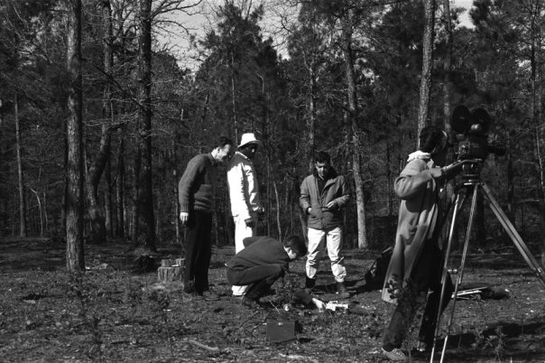
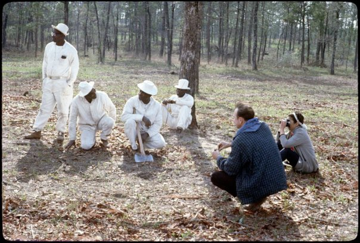

# 坎坎伐檀——从60年前的美国黑人民歌中追怀诗经

看了一个视频来自1966年的美国德州监狱，黑人囚犯喊着号子锄草砍树。锄头斧子起落间，音乐朴素优美、和声丰富。当地人管这种劳动号子叫河歌（river song）,因为在德克萨斯，所有监狱的种植园都位于布拉索斯河或三一河畔。

2600多年前，中国最早的民歌集《诗经》收录了一首《伐檀》：“坎坎伐檀兮，置之河之干兮，河水清且涟猗。”砍砍表音，伐檀表意。与视频中的声画完美契合。

伐檀：  
坎坎伐檀兮，置之河之干兮，河水清且涟猗。不稼不穑，胡取禾三百廛兮？不狩不猎，胡瞻尔庭有县桓兮？彼君子兮，不素餐兮？

坎坎伐辐兮，置之河之侧兮，河水清且直猗。不稼不穑，胡取禾三百镱兮7不狩不猎，胡瞻尔庭有县特兮？彼君子兮，不素食兮？

坎坎伐轮兮，置之河之漏兮，河水清且沦猗。不稼不穑，胡取禾三百国兮？不狩不猎，胡瞻尔庭有县鹁兮？彼君子兮，不素飧兮？

而画面中囚犯砍树时唱的这首《Jody》是这样的：

I've been working all day long  
Yeah, yeah, yeah, yeah  
Pickin' this stuff called cotton and corn  
Yeah, yeah, yeah, yeah  
We raise cotton, cane and a-corn  
'Tater and tomatoes and a-that ain't all  
Back is weak and I done got tired  
……
Yeah, yeah, yeah, yeah  
I see the captain sittin' in the shade  
He don't do nothin' but a he get paid  
We work seven long days in a row
……

（我等整日辛劳，摘棉花收玉米，种棉花种玉米种一切。当官的坐在阴凉处，他什么都不干却有俸禄。我们一周工作七天…）
与宗巴监狱犯人等的吟唱不同，劳动号子有更强的功能性。除了调剂生活、作为情绪的出口之外，几人一组在某一个节奏下工作，保证了没有人能偷懒。谁要是做慢了，很容易被听出来，然后被监工暴揍。

而某首歌的节奏快慢和起伏等也跟相应的劳作密切相关，比如砍树需要的力度大于锄草，对应的号子自然也就不同。

这个纪录片一共半小时，是美国民歌大神皮特·西格一家在德州亨茨维尔监狱拍的。当时的德克萨斯有14个监狱约12000名犯人。他们大都在种植园工作，条件相当艰苦。导演其实是西格的妻子toshiseeger，（toshi是一位日裔美国人，做导演、制片、环保。导演并制作的皮特·西格的音乐纪录片获艾美奖最佳纪录片），当时他们意识到随着机械化的推进这种音乐类型将很快成为历史，于是拍下了这段弥足珍贵的资料。事实上，不久之后，机械化的大幅应用以及黑人白人在同一个监狱导致劳动号子彻底废弃。

1966这一年，他们夫妻还做了一个音乐节Clearwater Festival，并成立了一个公益环保机构，音乐节的收入计入环保基金。如今该音乐节已是美国历史最久、规模最大的音乐节之一。

纪录片中的部分歌后来也得到出版，在片里担任旁白的Bruce Jackson录了几十首这样的劳动号子，其中有11首结集成一张叫《wake up dead man》的唱片。  

