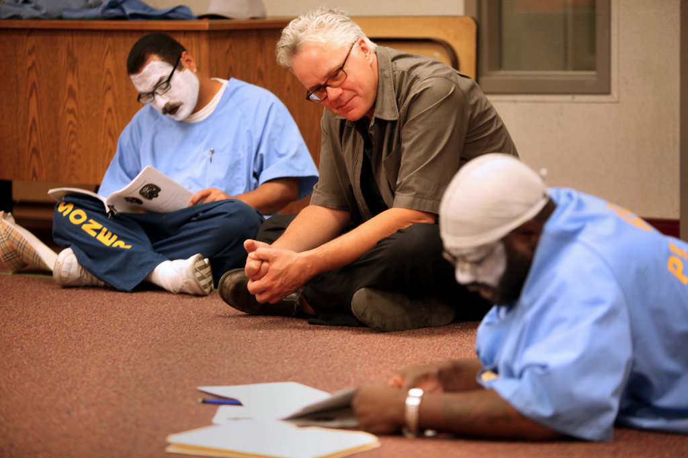
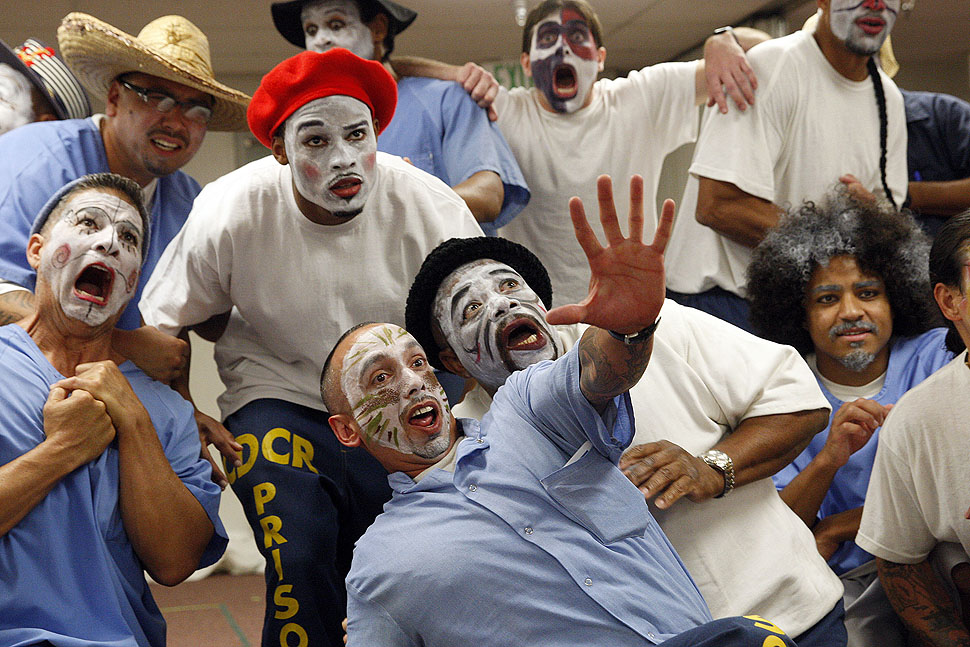
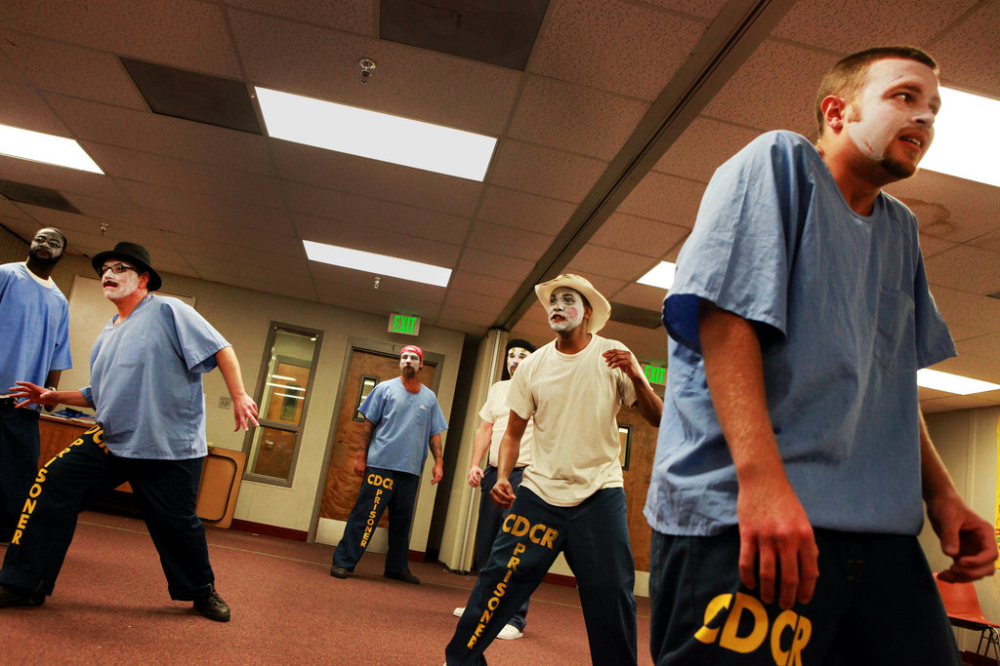

# 铁栏与面具之后：用戏剧影响囚犯

​​  

好莱坞影星蒂姆·罗宾斯因出演1994年的电影《肖申克的救赎》广为人知。罗宾斯从肖申克成功“越狱”，用实际行动告诉人们羽毛鲜艳、崇尚自由的鸟儿终将离开铁笼。奉行“要么忙着活，要么忙着死”的信条，他饰演的安迪在监狱中完成了一个个有意义的项目，建图书馆、帮助囚犯获得高中文凭、以及最后自己重获自由。2006年，罗宾斯带领他的团队洛杉矶“演员帮”剧团（The Actor’s Gang，简称TAG）重新回到铁栏之后，开展一个名为监狱计划（The Prison Project）的项目，但是这一回他所忙碌的不再是电影中的洗钱与做税表，而是希望用戏剧来影响囚犯。

罗宾斯对监狱似乎有一种特殊的情结。除《肖申克的救赎》外，1995年由他执导并获多项奥斯卡提名的《死囚漫步》也与监狱和囚犯有关。罗宾斯在纽约曼哈顿长大，他曾目睹很多儿时伙伴进入监狱。“与他们相比，我觉得我很幸运，”罗宾斯说。

这一每期持续八周的项目在美国加州的三座监狱中已经开展了八年,每年至少举行三期，吸引了500多名囚犯参与其中。项目听起来就很疯狂：在一个教室里，自愿参与该项目的囚犯学员们一改平日麻木的神情在脸上涂着油彩，采用16世纪意大利传统戏剧形式表演高兴、生气、悲伤、恐惧四种情绪，演绎自己的生活与角色。

项目致力于通过艺术教育促进宽容、引导犯人掌握非暴力的表达，最终，降低再犯率。

​​  

“这个项目与罗宾斯的理想与人生哲学十分一致，他坚信戏剧对社会改变至关重要，因为戏剧能对社会最需要也是最难做出改变的部分产生深远的影响。” “监狱计划”的项目负责人萨布拉·威廉斯(Sabra Williams)说，“从监狱制度上看，美国可能是世界上最差的国家之一。而加利福尼亚就在那儿，等着我们去改变。”

“监狱计划”是加州政府支持的艺术矫正项目的一部分。这个项目成立于1980年，通过邀请艺术家进监狱授课来影响囚犯。自2000年起因州内财政资助减少该项目萎缩，2010年一度取消。2014年又重新启动。在此期间“监狱计划”却并未中止。

“监狱计划”推广的是戏剧，这带来一些“麻烦”。要让囚犯们化妆、戴面具并非易事，因为这样做很可能会被其他囚犯笑话。威廉斯举了一个名为克里斯的囚犯的例子，在因斗殴入狱之前，克里斯是一名帮派成员，他坚信自己活不过三十岁。威廉斯回忆说，“当他发现要往自己脸上化妆时，他大喊道我绝不干，我又不是同性恋！”威廉斯试图说服他，但克里斯始终保持着一种抵触情绪，并称自己只是因为无意中拿了一张票于是过来看看情况。

​​  

​​  

​​  

​​  

​​  

​​  

像克里斯一样，绝大多数学员在前两周都会一边叫嚷着不愿化妆但一边又留下来“看看情况”。“在一开始，往往会有很多的抵触，因为化妆意味缺乏男子气概，也将因此招来嘲笑。”威廉斯说， “但是当画上面具之后他们才发现，种族的界限因此消失了，没有人会去歧视他们。在面具之后，他们反而收获了一种难得的自由。”

克里斯还是不愿画上面具，与威廉斯理论再三之后他重重地摔门而去。这种沮丧的场面威廉斯已多见不怪，第三周一般是退课周，因为在前两周他们已经见过了这位励志的“越狱”好莱坞明星同时也尝试了新鲜事物，但是只有那些坚持下来的学员才能真正体会到艺术的力量。一个小时之后，当威廉斯从另一个监狱回来时，她推开门，看到克里斯重新回到了舞台上，画着面具，很用心地与别的学员在一起表演。后来，他成了戏剧班上的领头人。“这真的需要极大的勇气，”威廉斯感慨说。

​​  

“监狱项目”初见效果。根据加利福尼亚州惩戒改造局的2013年度报告，刑满释放的犯人在三年之内因累犯重回监狱的比例约65% ；而三年内的累犯比例在参与过“监狱计划”戏剧项目的学员中——近乎为零。由于政府不允许TAG剧团对囚犯做相关研究，所以这一数字是基于反馈的估值。

虽然没有确凿的数据统计，但艺术矫正的倡导者认为这种计划有利于培养囚犯的同理心和同情心，帮助他们控制情绪，以便更好回归和融入社会生活。威廉斯在接受采访时说，在极其制度化的监狱中，犯人通常需要抑制自己的情绪，但是在表演的过程中，囚犯可以去正视和表达自己的各种情绪。“他们忽然发现自己能够真正地‘感觉’到一些事物，而这种‘感觉’在监狱生活中是通常不存在的。通过表演，他们不仅表达自己的情绪，同时也感受到了别人的情绪，从而产生了一种移情的作用。这帮助他们学会去控制自己的情绪和行为，从一定程度上避免了他们回到社会之后再次走上犯罪的道路。”

在《肖申克的救赎》中，有一句令人心酸的台词：“这些高墙还真有点意思，一开始你憎恨它们，然后你开始习惯，最后你会变得依赖它们。”事实的确如此，在监狱中，犯人极易被制度化，这导致他们很难重新融入社会。“这个项目的核心价值在于让这些犯人重新获得一种集体感，在戏剧班上他们是整体的一部分，每一个成员都与这个整体密切相关，在精神上都相互支持。通过这个项目，他们会把别人当做‘人’来看待，同时也将自己当做真正的‘人’。TAG剧团教育项目的负责人汉娜·乔多斯(Hannah Chodos)说。

TAG剧团与美国青少年政策研究所合作，在加州公立中小学中开展了一系列免费的戏剧教育项目。乔多斯补充说，“戏剧的魅力就在于此，无论是对孩子还是对那些犯人来说，被他人看见与关注是多么重要。我们的项目使那些社会中的隐形人受到了人们的关注。”

与艺术教育的积极影响形成鲜明对比的，是政策的瑕疵。在“监狱计划”及其他教育项目成就的背后，是罗宾斯和TAG成员这些个人们八年来为此付出的不懈努力和困难重重。

从2010年起，为了减少财政赤字加州政府取消了州内公立学校的艺术项目。威廉斯现年14岁的儿子正在加州的公立学校就读，在他的学校艺术课程已经从必修变成了选修。“艺术已经不像以前那样是学生每天生活的一部分了，”威廉斯带着几分遗憾感慨，“学生为了想去一个好大学，他们不会再去选修艺术课程，还不如多选一门语言课。”

与学校相比，监狱每年收到的财政补贴要多得多，但是问题仍然突出。在TAG的网站上，有一组标题为“你知道吗”的数据：加州政府每年花在一个学生身上的平均费用为9375美元（2010年数据），而花在一个囚犯身上的平均费用却高达47172美元（2009年数据）。威廉斯介绍，政府把这些钱大多用在了兴建监狱以容纳数量日益增多的囚犯，而仅有很少部分的预算会花在那些帮助囚犯重新适应社会的改造/康复项目上面。自从2010年加州政府取消监狱中的“艺术矫正项目”后，罗宾斯和威廉斯仍一直努力坚持把艺术带进监狱，他们除了要克服行政方面的阻力之外，还要四处募钱。目前，TAG剧团约有25名演员作为志愿者参与“监狱计划”，全都分文不取。2012年美国CBS新闻将他们形容为“少数仍在有效地用艺术参与囚犯矫正的的加州艺术团体之一”。

2011年《纽约时报》一篇报道显示，加州州内监狱关押的囚犯总数在14万左右，几乎所有的监狱都已经极度拥挤。在这种情况下，2012年联邦法庭授权加州政府释放数千名囚犯，然而许多囚犯很快会再度入狱。

“囚犯数量增多的一个原因是因为那些出狱不久的犯人又会回到监狱，我们的监狱制度没有帮助他们准备好回到这个社会。”威廉斯说，“如果能多支持像我们这样的艺术项目，也许情况会好得多。现在的情况是他们在囚犯刑满出狱的时候给他两百美元，然后告诫他以后不要再去犯罪。但是，他们还是会继续走上犯罪的道路。”

“我们的制度就是设计好了要把这些人重新带回监狱，他们没有任何工具帮助自己重返这个社会，”乔多斯说，“尤其是对于那些有色人种和贫困群体，整个制度都在指引他们重新回到监狱。”

罗宾斯和威廉斯一度扮演着说客的角色，他们去会见州内的政客，向他们展示“监狱计划”项目这八年来的成果。“他们无需来控制我们正在做的事，但是政府有责任为此埋单，”威廉斯说。

2014年，TAG剧团收到了政府 112000美元的拨款，加利福尼亚州惩戒改造局总计拨款250万美元用于资助在州内监狱中开展的戏剧项目。威廉斯激动地说，“这是八年来我们第一次获得政府的财政资助！”此外，TAG剧团得到了政府的授权收集相关数据，在三个监狱内开展一项为期五年的研究。

参与“监狱计划”的这些学员们无疑是幸运的，甚至还有人质疑他们“过于幸运”。作为囚犯（尤其是暴力罪犯，如杀人犯），他们是否有权在监狱中“享受”艺术教育，每周四个小时跟好莱坞明星一起玩耍娱乐。如果你是受害人或其家属，在这一涉及道德的问题上也许你也会先打个问号。2013年，罗宾斯在接受BBC访问时也被主持人质问类似的问题，但罗宾斯坚持认为这些囚犯已经失去了自由、受到了惩罚，不应再失去其它受启发与教育的机会。

“监狱计划”参与者认为从更长远的角度来看，为囚犯提供（艺术）教育与维护社会公正并不矛盾。“我们的项目事实上是在为全体公民谋福利。难道你想走在大街上，身边充斥着那些刚出狱但未被改造过的囚犯吗？”乔多斯反问，“当他们重新回到这个社会时，我们必须保证他们已经准备好重新参与到社区建设中来。”

这种将艺术的力量引入监狱，以达到矫正效果的项目在美国越来越普遍。除了戏剧项目，在美国的一些监狱中还有诸如“创作性写作课程”等项目帮助改造囚犯。麻省理工学院的海伦·依莲·李(Helen Elaine Lee)教授在萨诸塞州的一座监狱教囚犯写作，他们的话题具体到儿时的玩具和游戏，抽象至“阳刚之气”和味觉，从这些回忆中去探索事物的本质，以展现出同情心与责任感。 2011年前艺术推广人士薇尔莱特·彼得斯(Violette Peters)对《纽约时报》这样评论监狱中的艺术矫正项目：“当他们忙着写诗，就没有空来制毒。”

“艺术教会了我如何做出选择，”乔多斯说，“在艺术这个安全的空间里，我们可以自由地跟随自己的直觉与情绪，从中体察发生的一切，并审视我们以前做出的选择。如此，在将来我们也许可以做出不一样的选择。这一点对我们的人生有着非常深刻的含义。艺术教育使得我们超越对错二元选择的局限，让我们以更开放、更具创造性的视角去经历和思考人生，而我们的人生本来就是很复杂的。”

“我们的希望是，在五年内，我们将能够培养出更多的群体，并引导他们也去做这项工作。”罗宾斯说。

​​  
