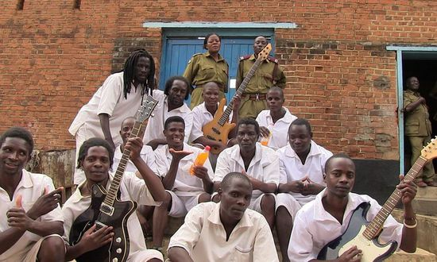
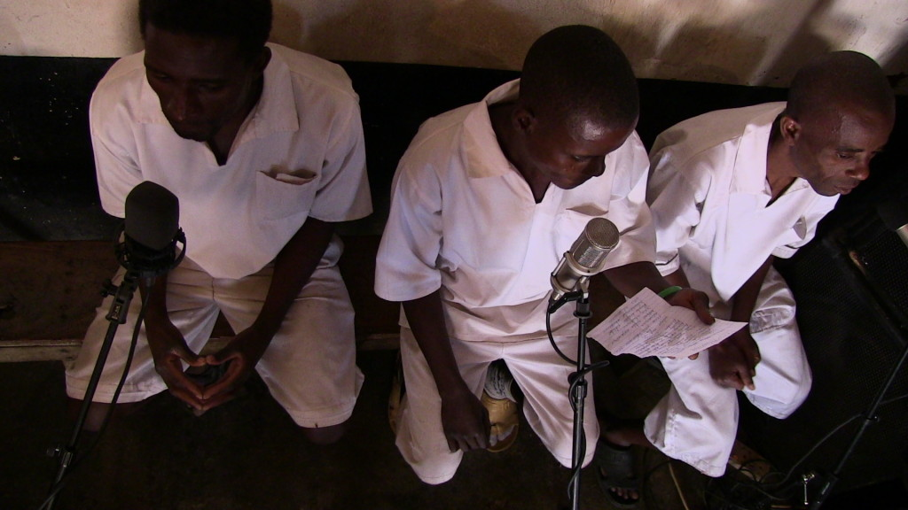
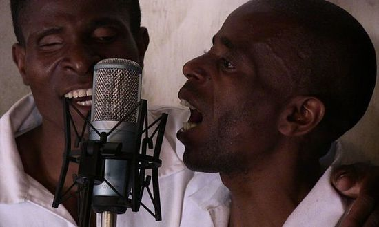

# 宗巴监狱项目

2月16号格莱美音乐奖落下帷幕，入围提名的Zomba Prison Project（宗巴监狱项目）惜败。这张专辑名字叫《I Have No Everything Here》（我在这儿一无所有）。

专辑有20首歌，60位词曲创作者和演唱者全部是非洲东南部国家马拉维共和国一个监狱里的囚犯。他们没有被允许在作品中署名。

马拉维是世界上最贫穷的国家之一。有一千两百万人口。严重依赖国际援助，经济以农业为主。人均寿命39.4岁。小学升学率4.5%。官方语言是齐切瓦语和英语。乐坛大姐麦当娜就多次到访并捐助马拉维多个慈善项目，2009年她在马收养一名男童，2012年收养一名女童。

根据世界监狱研究中心的报告，马拉维有12156位犯人，犯人占总人口比为万分之73，低于世界平均水平（144）。但是监狱条件差，超负荷关押犯人。

宗巴曾经是马拉维的首都（1974年被利隆圭Lilongwe取代）。宗巴监狱是马拉维最大也是安全级别最高的监狱。建于19世纪，这个陈旧的砖结构建筑，除了铁丝和栅栏、就是黄土和黄砖。很多狱警都睡一墙之隔的地铺。设计的容量是340人，如今里面关押着2000多个犯人。

大多数犯人都被判处终身监禁。这里，男人，女人，老人和小孩一起生活。判刑的理由五花八门。除了是谋杀、偷盗和袭击等罪名，还有所谓的“行巫”或者同性恋。宗巴的50多名女性囚犯，很多被判“行巫”，其实主要是她们在“不恰当的时间出现的不恰当的地方”。很多人在这里呆了多年，却没有经过审判。因为没钱打官司和保释，许多人只能接受一直被关押下去的命运。
2011年8月，美国的音乐制作人伊恩·布伦南和他的爱人摄影师和电影制片达利，偶然间，发现了这个监狱里人们很热爱音乐。

  

“监狱里的男女囚犯之间形成了鲜明的区别，”布伦南说，“一些男囚犯不仅组成了一支乐队，而且把这支乐队的成立经过、作品创作的点点滴滴都详尽地记录了下来。”他们分工明确，甚至有着等级。乐队的领导涉嫌在一起偷盗其他乐队乐器的行为中谋杀而被判终身监禁。

“另一方面，女囚犯却没有任何乐曲，只能用桶当鼓来敲。她们据说是并不写歌。但是，事实上在没有太多鼓励的情况下，女囚犯们也都在靠口耳相传创作歌曲，在病床上作出了一些令人惊叹的歌曲，比如I Kill No More（我不再屠杀）。”

在监狱里，他们用音乐来自我表达。没有专业仪器，就把水桶当成鼓来伴奏。“音乐是无处不在的。在这个监狱，人们受到了各种束缚，他们用音乐来自我表达”。音乐是公平的，是所有人都能拥有并且需要的精神食粮。他们简单、质朴却充满灵魂的音乐打动了布伦南。

2013年，伊恩重新回到宗巴监狱，为这些犯人们录制专辑。这个决定看似简单却并不易行。他以教授反暴力课程为条件换取了10天与囚犯们相处的时间。他把囚犯组成了名为Zomba Prison Project的乐队，买来简单的乐器和录音工具，开始在监狱里为囚犯们展开了专辑录制工作。

开始的时候，男子乐队可以顺利进展，女人们却顾虑很多。她们坐在那里，却不敢迈出第一步。终于，第一个女人勇敢地站出来。随后，越来越多的女人加入，唱她们自己的故事，唱她们在高墙内的辛酸及苦中作乐的无奈。
在音乐里，他们丢开了所有的枷锁和束缚，肆意拍打手鼓，酣畅淋漓的跳舞。

女囚敲打用桶做的鼓，男囚则唱着和声，弹着破旧的吉他

录音的地方很随意。按照这些囚犯们的习惯，即兴地在各种不同的地方，留下不一样的旋律。

在空旷的操场上，或者是监狱内部的农场里……  
在监狱的室内，这些歌者陶醉地闭目吟唱……  
或者是在拥挤的囚室里，一同录进去的还有那嘈杂的背景人声……  

  
  

这些录音没有修饰，整整6个多小时，60多人参与了录制。包括几个监狱的守卫。最终形成的专辑收录了20首歌。它被命名为《I Have No Everything Here》。

完成了这张专辑，布伦南离开了马拉维，与这些囚犯失去了联系。

  

2015年1月布伦南在6record上发行了这张专辑。并把录制的过程剪辑成一个4分钟的纪录片。来看看这些人是怎么在音乐中体会到自由和快乐的。慢慢的，这张专辑被更多的人发现，并在12月7日获得了2016年的格莱美大奖的提名，和其他知名音乐人角逐“World Music”（世界音乐）。这些人创造了历史。这是东非国家第一次获得世界重量级音乐奖的提名。

通过他们的音乐，通过格莱美，更多的人知道了他们的故事。伊恩•布伦南用销售下载专辑获得的资金成立了一个基金，帮助他们离开监狱。目前为止，已经有三名妇女在这个基金的帮助下获得了自由，另外三起案件在积极审查中。更多的人伸出援助之手帮助无辜之人离开监狱。

专辑里面每首歌，都是一首诗。囚犯们用齐切瓦语，唱着自己编写的旋律，唱着那些快乐的、心碎的生活。

比如提名歌曲《请不要杀我的孩子》

『我一个人在宽阔的河流边上  
我没有越过它  
请不要杀了我的孩子』

您可以在[这里](http://zombaprisonproject.bandcamp.com/)可以购买专辑，售卖所得会作为上述基金，帮助更多坐冤狱的犯人重返自由。