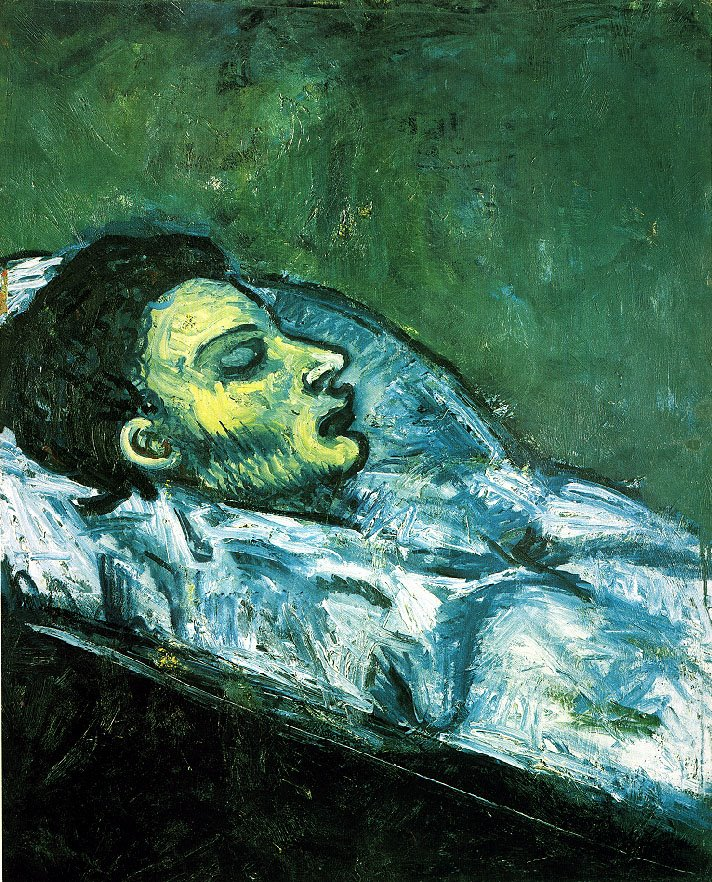
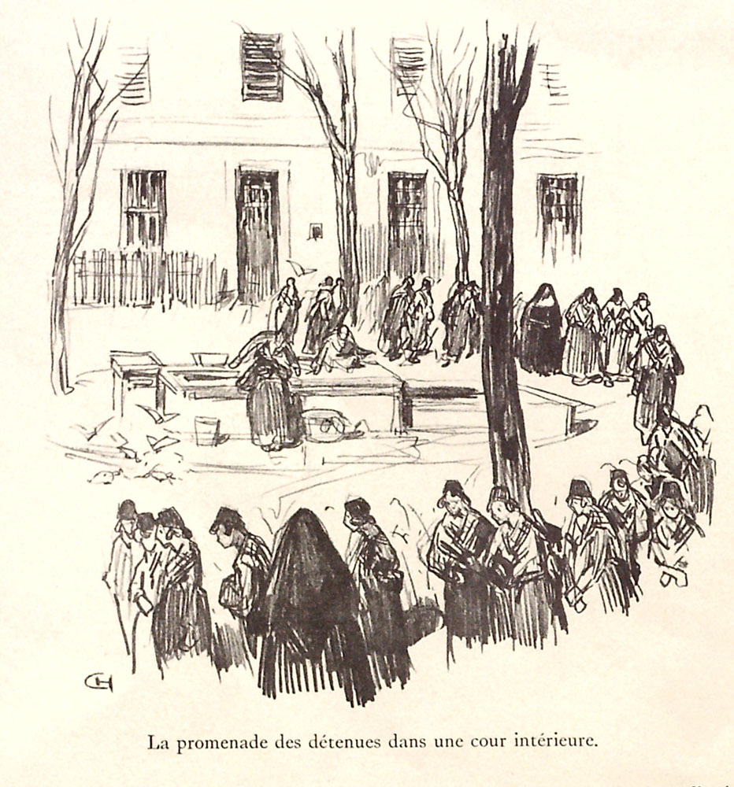
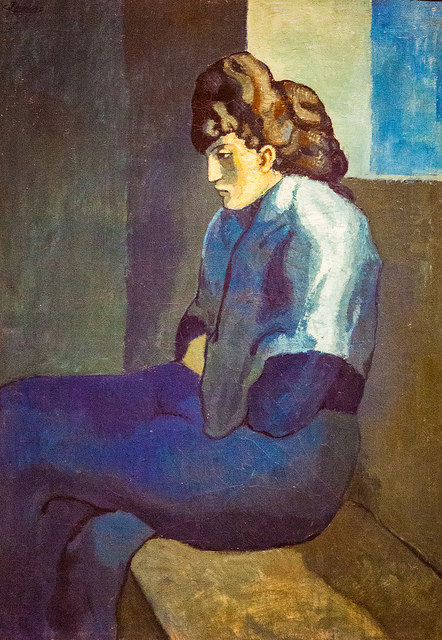
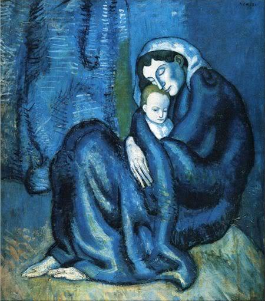
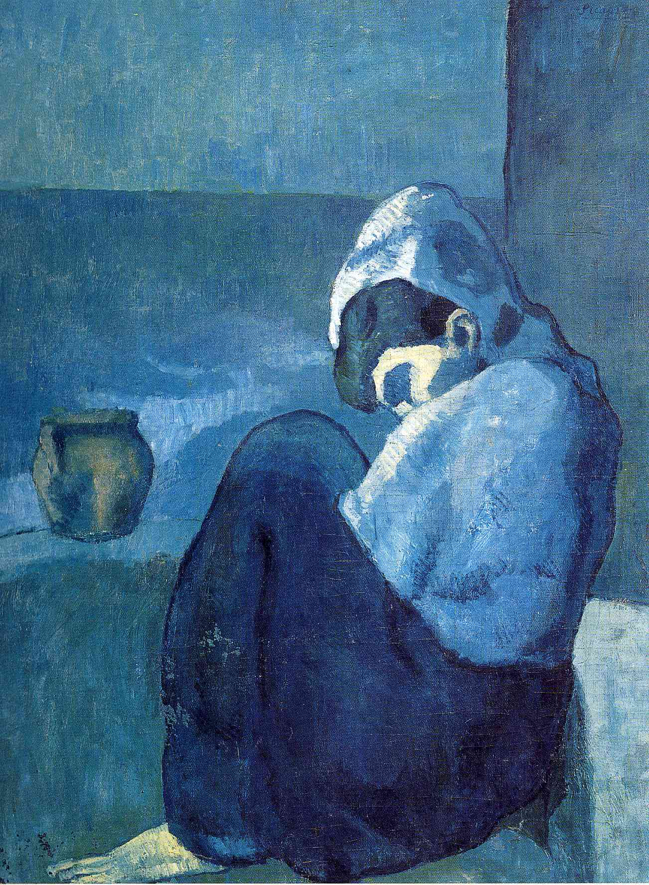
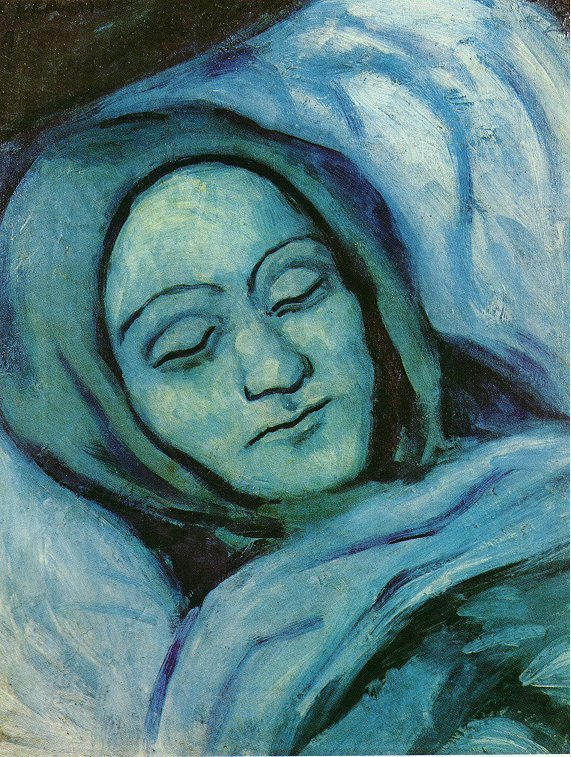
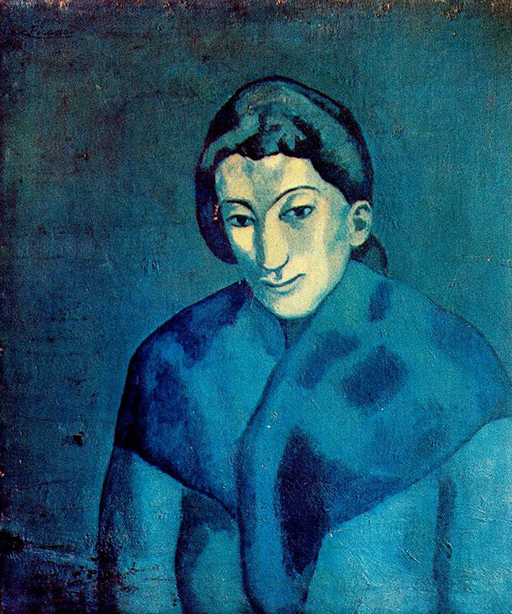
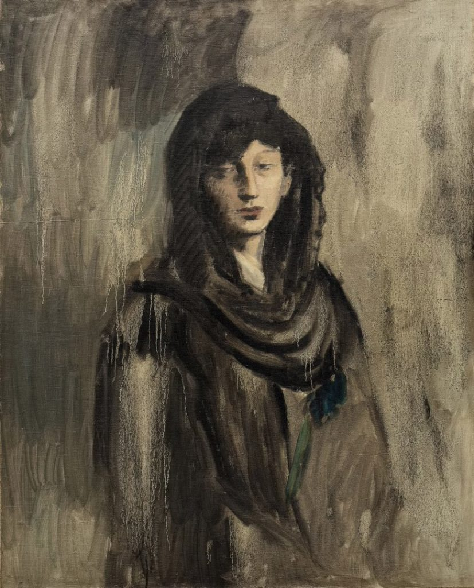
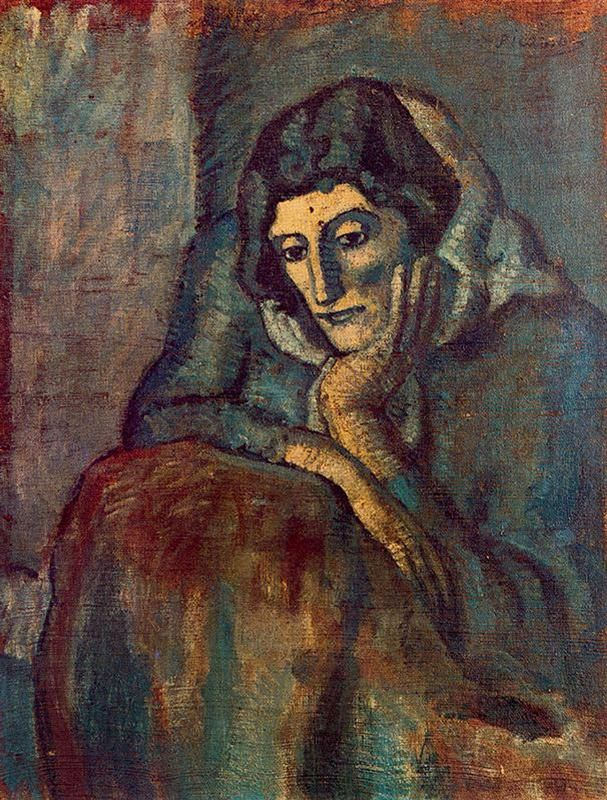
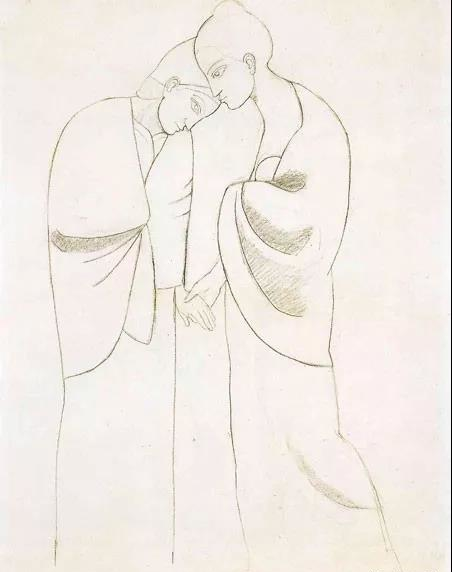

# 毕加索的蓝色时期与圣拉扎尔监狱

​1900年10月毕加索和好友卡萨吉玛斯一起到巴黎，四个月后醉酒的卡萨吉玛斯在一个名为Café de L’Hippodrome的咖啡馆求爱未遂，癫狂中举枪自尽。对好友的凭吊和追忆开启了毕加索的蓝色时期（1901——1904年），暗沉的、悲伤的蓝色，既是出于对卡萨吉玛斯的缅怀，也是他那几年在巴黎的姿态。

（casagemas in his coffin 1901）

1901年秋季开始，毕加索频繁出入巴黎蒙马特区的圣拉扎尔监狱（Saint-Lazare），并且将里面的囚犯用作自己创作的模特。圣拉扎尔几经变迁，12世纪用于隔离麻风病人，经17世纪重建，后曾作为修道院，1794年大革命期间被辟做监狱。被囚禁者多是因色情服务被逮捕的女子，有些还带着孩子。这些女性大多受到不同程度的性病侵蚀，那时候性病很难治愈，所以干脆把她们隔离起来。视她们曾经的靓丽为罪恶之源，而带来蓬勃生机的阳光，从不光顾这里。

  

20世纪初，在巴黎“美好年代”的熙熙攘攘和喧哗热闹中，圣拉扎尔监狱像是一个奇特的世界。它与世隔绝，时间仿佛在此凝滞。[ 注:美好年代(BelleEpoque)，法语，专指19世纪末到第一次世界大战前那段生活安定舒适的时期。] 长廊拱顶的连拱廊节奏单调，回响着女囚们列队出操的声音。

圣拉扎尔的妇女监狱向毕加索提供了剥夺，沮丧和无助的场景，以真实和切实的方式捕捉了他的感情。如果说之前毕加索在画面中使用蓝色还是潜意识里的忧伤使然，那么从这时的作品上可以看出，他是有意地让悲伤从笔下流淌而出，并且将情感附着在画布上了。当我们现在回过头来看他的创作生涯的时候，他第一批真正意义上形成自己风格的作品，就来自于他到访圣拉扎尔女子监狱的经历。并到达他蓝色时期第一阶段的高潮。这些囚犯身上的痛苦、压抑和忧郁简直是毕加索用以展现自己情绪的绝佳媒介。那段时间他画出了一批这种感觉的作品:

  
（melancholy woman 忧郁的女人）

  
(Mother And Child 母与子 1902)

  
（Crouching woman 蜷缩的女人 1902）

  
（woman with crossed arms 双手交叉的女人 1902）

  
（Woman_with_Bangs 1902）

  
(Head of dead woman 1902)

  
(woman in a shawl  1902)

毕加索无疑在他那“蓝色"世界观的支配下，在具体中发现了普遍：普遍悲伤的表达，其象征暗示的意义和打动人心的情感。毕加索既没有加上个体的特征，也没有加入社会的细节，而是仅仅表现了“永恒的女性”的阴暗面：他将它看作一种形而上学的、女性的苦难本质。[注: “永恒的女性”，19世纪盛行的概念，常常被描绘为天使，负责将男人引导到道德和精神的道路上。她谦逊、优雅、纯洁、敏感、端庄、顺从、慎言、贞洁、和蔼且礼貌。]

“智慧人的心，在遭丧之家。”(《圣经.旧约.传道书》7:4) 《传道书》里的这句话与当年21岁的毕加索该阶段的思想形成了共鸣——当时他继续追寻“永恒的女性”，发现到处都在蒙受苦难，并且看到了存在的悲剧本质。

他把病号服和女囚特有的白帽子这样的世俗细节变形为抽象的披风和类似于玛丽安娜的弗吉尼亚帽这样的物品。[ 注:玛丽安娜(Marianne)，法国的国家象征，自由与理性的拟人表现。弗里吉亚无边便帽( Phrygian cap)又称自由之帽，本为古代小亚细亚的弗里吉亚人所戴，是一种与头部紧密贴合的软帽，其帽尖向前弯曲，典型的颜色是红色。古希腊罗马文化中，弗里吉亚帽是东方的象征。在18世纪美国革命和法国大革命中，弗里吉亚帽成为自由和解放的标志而广为传播。]经过艺术家感知的变形处理，它们在毕加索的作品中变成圣拉扎尔的现实仅剩的一点儿模糊痕迹。然而它们的反复出现说明了监狱的严酷现实对蓝色时期的意象和特殊风格的影响多么强大，至少整个1902年都是如此。 6个月后，已经从巴塞罗那返回巴黎的毕加素继续完成另一幅作品，在写给马克斯·雅各的信中，毕加素将它描述为“一名圣拉扎尔妓女和一位母亲”。这幅画就是《两姐妹》。它还有另一个名称：《会见》（visit）。

  
(两姐妹握在一起的手所达到的动人效果，在油画中则通过画面的构图表达：这两个人物彼此依靠，构成了一个“拱门”，与左边背最中深色的拱门相“押韵”。)

画中，诸如面部表情和姿态这些附属细节，还有所有外表和服饰的具体特征逐渐都消失了。所有与描述事件相关的内容都被概括和简化了：地点是一面有拱门的墙；人物的动作和姿势拘谨被动；面容没有个性，服装模糊含混。毕加索不仅削减了细节，还有意识地将自己的表达方式限制到禁欲主义的程度。画面模糊、简约、单一的蓝色与这幅作品基本的品质、概括的造型和线性的特征非常相称。毕加索在简化形式的同时，赋予内容极大的复杂性和深度，将最初的题材变成了永恒普遍的事件，两个象征的姐妹在另一个世界中悲恸的会面。她们象征意义上的对立(崇高/卑微、永恒存在/注定死亡)通过画面的结构传达出来。代表母亲的人物强烈的、深沉的、天蓝的调子与自由流动的造型线条相呼应，而妓女那毫无生气的灰绿暗色调(潮湿的黏土的颜色)很符合人物岩石般的体积感”动作姿态参差不齐的线条节奏以及她披肩褶皱上葬礼般悲哀的暗影。

谢尔盖·希楚金说毕加索应该装饰教堂的时候，也许脑子里想的就是《两姐妹》。[ 注:这位俄罗斯收藏家有一句名言：“马蒂斯应该去装饰宫殿，而毕加索应该装饰教堂。”]

不断探索的毕加索在画出《人生》后进入新的人生阶段。

  
（La Vie, 1903年）

圣拉扎尔监狱则于1932年关闭，1935年被拆除。取而代之的是一家医院。

参考资料：《巴勃罗.毕加索》作者:维多利亚.查尔斯  安纳托里.颇多克西克  人民美术出版社，2016年

网络
