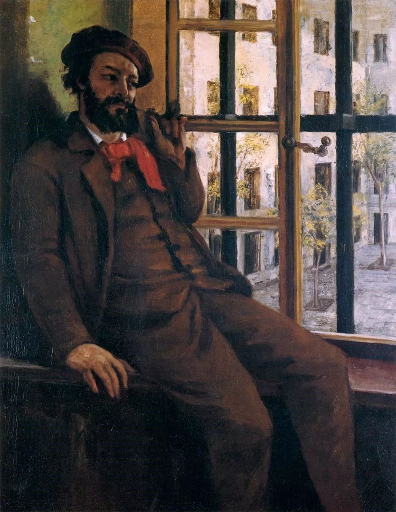
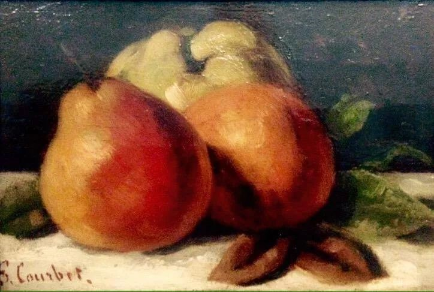
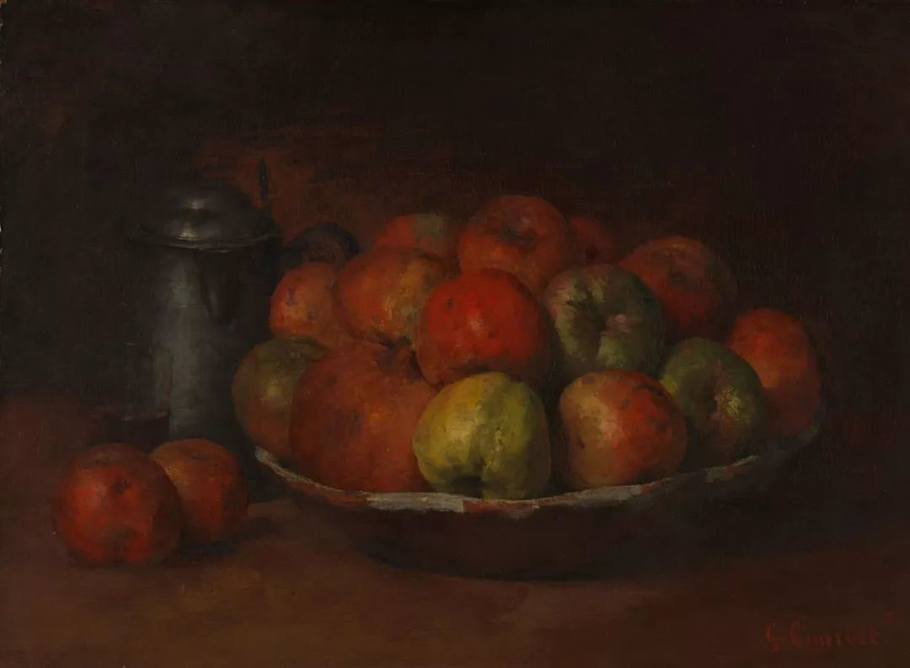
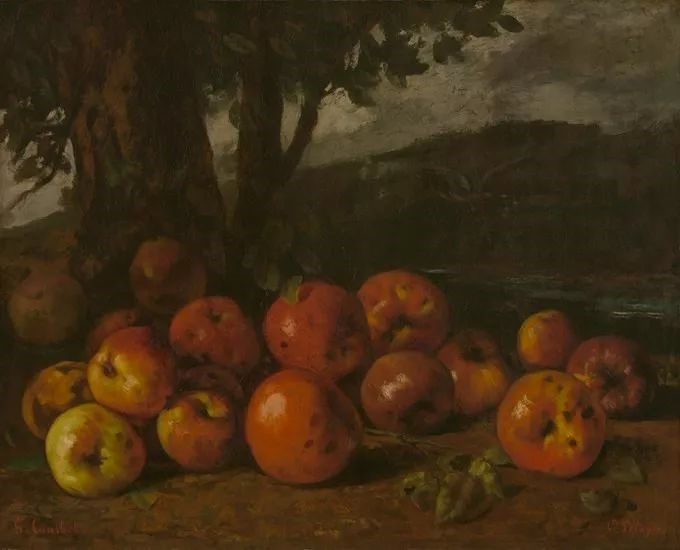

# 被囚禁的库尔贝先生

  
库尔贝在监狱期间的画作 1871年

古斯塔夫・库尔贝（1819—1877年）这个19世纪法国画家的名字，始终环绕着一道道的光环。现实主义绘画创始人，主张艺术反映现实与民间疾苦；离经叛道，桀骜不驯。"从不画天使"；画出争议不断的《世界的起源》。

在巴黎公社震撼世界的72天中，他成为巴黎公社委员、巴黎第六区代表，积极从事艺术机构与制度的改革。巴黎公社失败后他被判刑坐牢。

  
库尔贝监狱期间的画作 1870年

库尔贝虽然出生在一个富裕的葡萄园主家庭里，但他的祖父是1789年法国大革命的雅各宾党人，是伏尔泰的追随者。他从小就听祖父讲述革命的故事。这在他幼小单纯的心灵中种下了对专制制度不满的种子和对共和的向往。当1848年的二月革命和由无产阶级发动的六月革命来临时，库尔贝还深受空想社会主义思潮的影响。这一思想的代表人物普鲁东是他的好友。当时画家仅仅是对革命抱支持的态度，只是在1848年2月号的《向公众致敬》杂志上，发表了一幅名为《街头路障上的革命》的素描。那是对德拉克洛瓦描写1830年法国七月革命的名画――《自由领导着人民》的摹拟品，表现的是一个青年大学生正站在街头由巨石、大车等杂物堆成的路障上，一手举枪、一手握旗，号召着人们前进的情景。但他从心底里并不赞同这样的暴力斗争。他说：“我不相信开枪放炮的战斗，因为那不符合我的原则。我一直在进行着智力的战争。要我另搞一套绝不可能。”

革命失败后，为了避开血腥的屠杀与恐怖，库尔贝回到家乡奥尔良，创作了一些反映民间疾苦的现实性作品，客观地再现了拿破仑三世统治下人民的悲惨生活，画家藉此进行着所谓“智力的战争”。

在1855年的巴黎世博会期间，由于官方拒绝接受他的作品，库尔贝立即与之进行坚决的斗争，他在世博会附近自建一座木棚，举行现实主义的个人画展，并公开发表现实主义宣言，表明自己的主张。这成为世界美术史上的一件大事。随着画家声誉日隆，追随者亦不断增多，以及帝国危机的日益加剧，曾经鞭打过库尔贝画作的拿破仑一世企图拉拢他，试图给他发一枚荣誉勋章，借此收买人心。但画家断然拒绝，并声称：“荣誉不在于一个称号，也不在于一枚勋章”，“我不愿和(专制的)国家发生任何关系。”

1870年，为了缓和国内矛盾，拿破仑三世发动了普法战争，结果以失败而告终。普鲁士军不以俘获拿破仑三世为满足，开始大举进攻，法国危在旦夕。为了抵御外侮，一向反对“开枪放炮”的库尔贝这时用卖画所得捐献了一门大炮。

拿破仑失败后第三共和国成立。人们担心普军攻人巴黎，破坏和抢劫这儿的艺术品和文物，于1870年9月成立艺术委员会，负责国家博物馆及艺术品的监管与保护。库尔贝以其国内外的声望，当即被选为这一机构的主席。这时巴黎旺多姆广场上的那个纪念柱(通称“旺多姆纪念柱”)就成为在政治上十分敏感的问题。那是拿破仑一世为了宣扬帝国的成功，用从被征服者的手中夺得的1200门大炮熔化后竖立起来的一个庆功柱，“是帝制的象征，是对军国主义的确认……对法国革命三大原则之一――博爱的暴行”。因此委员会有人提出拆除该柱，用以铸造钱币的申请。库尔贝也在上面签了名，只是过了八个月后，巴黎公社执政期间这一申请才被具体执行。

巴黎公社成立后，库尔贝被选为公社委员兼造型艺术委员会主席，巴黎第六区代表。从此画家积极而愉快地投入工作，进行了许多重大改革。他说：“我每天起床，用早餐，出席并主持十二小时的会议……巴黎是真正的天堂，没有一个警察，没有一点谩骂，没有一点舞弊，没有一点争吵，真是快乐极了。”

巴黎公社失败后，梯也尔喊出要巴黎公社社员“全部抵赎自己罪责”的口号，大肆屠杀。库尔贝被扣以“损毁古迹”的罪名，判刑六个月，并处罚金五万法郎，随即从凡赛尔的拘留所转入巴黎圣佩拉监狱服刑，三个月后保外就医，直至1872年4月释放。此画为画家出狱一年后，据回忆对自己的描写。

  
《库尔贝在圣佩拉监狱》

窗外是一片深秋景色，库尔贝身躯高大，像一只被困的猛兽，拘禁在一间矮小的囚房里。窗外粗大的铁栏栅清晰可见。他独坐在窗前一张靠墙的长凳上，斜倚的身躯若不是那只粗大的手撑着，似乎就要从凳上滑落下来，给人以不安的感觉。他微低着头，视而不见地面对着前面什么地方，沉浸在思索与回忆的气氛之中。他是在回忆往事，总结多事的人生，还是在探索巴黎公社失败的缘由?同时代人乔治・阿利特在一篇日记中谈到当时的库尔贝时写道：“他一出现，所有的见证人都为他变化之大而感到吃惊。头发全灰白了，明显的病态使人们几乎认不出他来。他憔悴不堪，疾病缠身，失去了往日的健壮。”但库尔贝这个知名的现实主义者并没有真实地反映自己当时的外貌，画作中的他仍是黑发短须，身体仍然健壮，只是面部流露出淡淡哀愁。胸前那块领巾的红色，像火种，仍然燃烧在他的心中，展示出一股不屈服的力量。如果能再给他一次机会，他进行的绝不可能是“智力的战争”，因为沙龙已不再允许他展出作品了。

  
1871年

  
1871年

  
1871年

库尔贝出狱后，当局仍视之为敌人，继续对他加以迫害，以“重建旺多姆柱”的名义，处以他极重的罚金。库尔贝无法支付，只得逃亡瑞士，于1877年病死他乡。
